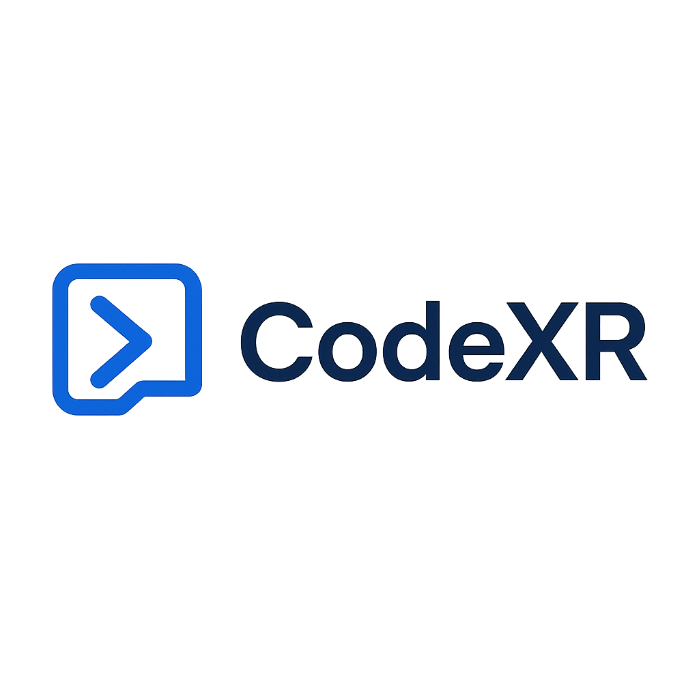

<p align="center">
  
</p>

<h1 align="center">CodeXR — Live AR/VR Assistant</h1>
<p align="center">🚀AR/VR developer assistant powered by Gemini + Serper + Google OAuth</p>

---

## ✨ Features

- 🔐 Secure Google OAuth + Manual login (bcrypt)
- 📚 Per-user chat history stored in JSON (easy to extend with DB)
- 🎨 Futuristic UI with neon themes, gradients & smooth animations
- 🤖 Gemini + Serper integration for AR/VR queries
- 🐳 Dockerfile + docker-compose + GitHub Actions CI/CD pipeline

---

## 🛠️ Installation

Clone the repository:

```bash
git clone https://github.com/manit25/CodeXR.git
cd CodeXR
Set up environment variables:

bash
Copy code
cp .env.example .env
# Fill in your API keys and Google OAuth credentials


Install dependencies:

bash
Copy code
python -m pip install -r requirements.txt


🚀 Usage
Run the authentication server:

bash
Copy code
python auth_server.py
Run the main app:

bash
Copy code
streamlit run app.py

🐳 Run with Docker
bash
Copy code
docker build -t codexr .
docker run -p 8501:8501 --env-file .env codexr


📂 Project Structure
bash
Copy code
CodeXR/
├── app.py               # Streamlit main app
├── auth_server.py       # Flask OAuth backend
├── codexr/              # Core package (auth, LLM, utils, schema, etc.)
├── assets/              # Logos, icons
├── history/             # Per-user chat history
├── user_data/           # Manual signup/login user data
├── requirements.txt     # Python dependencies
├── Dockerfile           # Container setup
├── docker-compose.yml   # Orchestration
└── .github/workflows/   # CI/CD pipeline

🤝 Contributing
Pull requests are welcome! For major changes, please open an issue first.
Make sure to update tests as appropriate.

📜 License
MIT License © 2025 Manit Srivastava
```
